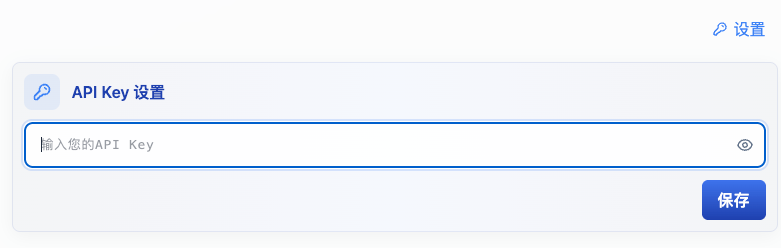

# 使用说明

本项目支持CF部署：

- `main`分支不作为部署分支

- `gemini-tts` 分支部署的是 Gemini TTS
- `openai-tts` 分支部署的是 OpenAI TTS
- `ms-tts` 分支部署的是  Microsoft Azure TTS (原项目：[zuoban/tts: tts 服务](https://github.com/zuoban/tts?tab=readme-ov-file))
  - 添加环境变量`API_KEY` (限制用户使用，当设置了`API_KEY`之后，用户在前端页面访问时，需要设置一样的`API Key 设置`才能访问)
  - 
    - Workers & Pages -> Your Worker -> Settings -> Variables and Secrets -> Add
    - Type: `Secret`, Name: `API_KEY`, Value: `YOUR_API_KEY`

参考：
- [【分享】自建TTS服务 - 高质量文本转语音工具 - 资源荟萃 - LINUX DO](https://linux.do/t/topic/482507)
- [Gemini TTS Client开源了！ - 资源荟萃 - LINUX DO](https://linux.do/t/topic/1015686)
- [OpenAI TTS源码新版来了 - 开发调优 - LINUX DO](https://linux.do/t/topic/425924)